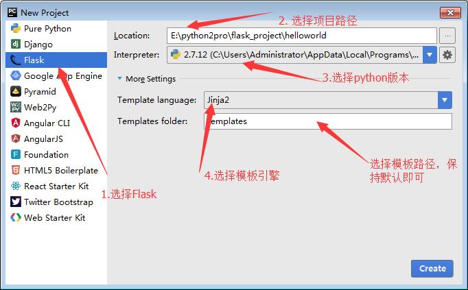

# flask入门（URL）

### flask简介：

`flask`是一款非常流行的`Python Web`框架，出生于2010年，作者是`Armin Ronacher`,本来这个项目只是作者在愚人节的一个玩笑，后来由于非常受欢迎，进而成为一个正式的项目。目前为止最新的版本是`0.11.1`。

`flask`自2010年发布第一个版本以来，大受欢迎，深得开发者的喜爱，并且在[多个公司](http://flask.pocoo.org/community/poweredby/)已经得到了应用，flask能如此流行的原因，可以分为以下几点：

- 微框架、简洁、只做他需要做的，给开发展提供了很大的扩展性。
- Flask和相关的依赖（Jinja2、Werkzeug）设计得非常优秀，用起来很爽。
- 开发效率非常高，比如使用`SQLAlchemy`的`ORM`操作数据库可以节省开发者大量书写`sql`的时间。
- 社会活跃度非常高。

`Flask`的灵活度非常之高，他不会帮你做太多的决策，即使做已经帮你做出选择，你也能非常容易的更换成你需要的，比如：

- 使用`Flask`开发数据库的时候，具体是使用`SQLAlchemy`还是`MongoEngine`或者是不用`ORM`而直接基于`MySQL-Python`这样的底层驱动进行开发都是可以的，选择权完全掌握在你自己的手中。区别于`Django`，`Django`内置了非常完善和丰富的功能，并且如果你想替换成你自己想要的，要么不支持，要么非常麻烦。
- 把默认的`Jinija2`模板引擎替换成`Mako`引擎或者是其他模板引擎都是非常容易的。

### 第一个flask程序：

用`pycharm`新建一个`flask`项目，新建项目的截图如下：  点击`create`后创建一个新项目，然后在`helloworld.py`文件中书写代码：

```
    #coding: utf8    

    # 从flask框架中导入Flask类
    from flask import Flask

    # 传入__name__初始化一个Flask实例
    app = Flask(__name__)

    # app.route装饰器映射URL和执行的函数。这个设置将根URL映射到了hello_world函数上
    @app.route('/')
    def hello_world():
        return 'Hello World!'

    if __name__ == '__main__':
        # 运行本项目，host=0.0.0.0可以让其他电脑也能访问到该网站，port指定访问的端口。默认的host是127.0.0.1，port为5000
        app.run(host='0.0.0.0',port=9000)

```

然后点击运行，在浏览器中输入`http://127.0.0.1:9000`就能看到`hello world`了。需要说明一点的是，`app.run`这种方式只适合于开发，如果在生产环境中，应该使用`Gunicorn`或者`uWSGI`来启动。如果是在终端运行的，可以按`ctrl+c`来让服务停止。

### 设置为DEBUG模式：

默认情况下`flask`不会开启`DEBUG`模式，开启`DEBUG`模式后，flask会在每次保存代码的时候自动的重新载入代码，并且如果代码有错误，会在终端进行提示。

开启`DEBUG`模式有三种方式：

1. 直接在应用对象上设置：

   ```
   app.debug = True
   app.run()

   ```

2. 在执行`run`方法的时候，传递参数进去：

   ```
   app.run(debug=True)

   ```

3. 在`config`属性中设置：

   ```
   app.config.update(DEBUG=True)

   ```

   如果一切正常，会在终端打印以下信息：

   ```
   * Restarting with stat
   * Debugger is active!
   * Debugger pin code: 294-745-044
   * Running on http://0.0.0.0:9000/ (Press CTRL+C to quit)

   ```

需要注意的是，只能在开发环境下开启`DEBUG`模式，因为`DEBUG`模式会带来非常大的安全隐患。

另外，在开启了`DEBUG`模式后，当程序有异常而进入错误堆栈模式，你第一次点击某个堆栈想查看变量值的时候，页面会弹出一个对话框，让你输入`PIN`值，这个`PIN`值在你启动的时候就会出现，比如在刚刚启动的项目中的`PIN`值为294-745-044，你输入这个值后，`Werkzeug`会把这个`PIN`值作为`cookie`的一部分保存起来，并在8小时候过期，8小时以内不需要再输入PIN值。这样做的目的是为了更加的安全，让调试模式下的攻击者更难攻击到本站。

### 项目配置：

`Flask`项目的配置，都是通过`app.config`对象来进行配置的。比如要配置一个项目处于`DEBUG`模式下，那么可以使用`app.config['DEBUG] = True`来进行设置，那么`Flask`项目将以`DEBUG`模式运行。在`Flask`项目中，有四种方式进行项目的配置：

1. 直接硬编码：

   ```
   app = Flask(__name__)
   app.config['DEBUG'] = True

   ```

2. 因为`app.config`是`flask.config.Config`的实例，而`Config`类是继承自`dict`，因此可以通过`update`方法：

   ```
   app.config.update(
      DEBUG=True,
      SECRET_KEY='...'
   )

   ```

3. 如果你的配置项特别多，你可以把所有的配置项都放在一个模块中，然后通过加载模块的方式进行配置，假设有一个`settings.py`模块，专门用来存储配置项的，此时你可以通过`app.config.from_object()`方法进行加载，并且该方法既可以接收模块的的字符串名称，也可以模块对象：

   ```
   # 1. 通过模块字符串
   app.config.from_object('settings')
   # 2. 通过模块对象
   import settings
   app.config.from_object(settings)

   ```

4. 也可以通过另外一个方法加载，该方法就是`app.config.from_pyfile()`，该方法传入一个文件名，通常是以`.py`结尾的文件，但也不限于只使用`.py`后缀的文件：

   ```
   app.config.from_pyfile('settings.py',silent=True)
   # silent=True表示如果配置文件不存在的时候不抛出异常，默认是为False，会抛出异常。

   ```

`Flask`项目内置了许多的配置项，所有的内置配置项，可以在[这里查看](http://flask.pocoo.org/docs/0.10/config/#builtin-configuration-values)。

### URL与函数的映射：

从之前的`helloworld.py`文件中，我们已经看到，一个`URL`要与执行函数进行映射，使用的是`@app.route`装饰器。`@app.route`装饰器中，可以指定`URL`的规则来进行更加详细的映射，比如现在要映射一个文章详情的`URL`，文章详情的`URL`是`/article/id/`，id有可能为1、2、3...,那么可以通过以下方式：

```
   @app.route('/article/<id>/')
   def article(id):
       return '%s article detail' % id

```

其中`<id>`，尖括号是固定写法，语法为`<variable_name>`，`variable_name`默认的数据类型是字符串。如果需要指定类型，则要写成`<converter:variable_name>`，其中`converter`就是类型名称，可以有以下几种：

- string: 默认的数据类型，接受没有任何斜杠“\/”的文本。

- int: 接受整形。

- float: 接受浮点类型。

- path： 和string的类似，但是接受斜杠。

- uuid： 只接受uuid字符串。

- any：可以指定多种路径，这个通过一个例子来进行说明:

  ```
    @app.route('/<any(article,blog):url_path>/')
    def item(url_path):
        return url_path

  ```

  以上例子中，item这个函数可以接受两个`URL`,一个是`/article/`，另一个是`/blog/`。并且，一定要传`url_path`参数，当然这个`url_path`的名称可以随便。

如果不想定制子路径来传递参数，也可以通过传统的`?=`的形式来传递参数，例如：`/article?id=xxx`，这种情况下，可以通过`request.args.get('id')`来获取`id`的值。如果是`post`方法，则可以通过`request.form.get('id')`来进行获取。

### 构造URL（url_for）：

一般我们通过一个`URL`就可以执行到某一个函数。如果反过来，我们知道一个函数，怎么去获得这个`URL`呢？`url_for函数`就可以帮我们实现这个功能。`url_for()`函数接收两个及以上的参数，他接收**函数名**作为第一个参数，接收对应**URL规则的命名参数**，如果还出现其他的参数，则会添加到`URL`的后面作为**查询参数**。

通过构建`URL`的方式而选择直接在代码中拼`URL`的原因有两点：

1. 将来如果修改了`URL`，但没有修改该`URL`对应的函数名，就不用到处去替换`URL`了。
2. `url_for()`函数会转义特殊字符和`Unocode数据`，这些工作都不需要我们自己处理。

下面用一个例子来进行解释：

```
    from flask import Flask,url_for
    app = Flask(__name__)

    @app.route('/article/<id>/')
    def article(id):
        return '%s article detail' % id

    # 这行的代码可以在交互模式下产生请求上下文，不用`app.run()`来运行这个项目，直接可以运行下面的代码，
    # 也会有`flask`上下文
    with app.test_request_context():
        print url_for('article',id='1')
        print url_for('article',id='2',next='/')

```

```
执行后的结果如下：
> /article/1/
> /article/2/?next=%2F

```

### 自定义URL转换器：

刚刚在URL映射的时候，我们看到了`Flask`内置了几种数据类型的转换器，比如有`int/string`等。如果`Flask`内置的转换器不能满足你的需求，此时你可以自定义转换器。自定义转换器，需要满足以下几个条件：

1. 转换器是一个类，且必须继承自`werkzeug.routing.BaseConverter`。
2. 在转换器类中，必须实现`to_python(self,value)`方法，这个方法的返回值，将会传递到`view`函数中作为参数。
3. 在转换器类中，必须实现`to_url(self,values)`方法，这个方法的返回值，将会在调用`url_for`函数的时候生成符合要求的`URL`形式。

比如，拿一个官方的例子来说，`Reddit`可以通过在`URL`中用一个加号（+）隔开社区的名字，方便同时查看来自多个社区的帖子。比如访问“www.reddit.com\/r\/flask+lisp\/”的时候，就同时可以查看flask和lisp两个社区的帖子，现在我们自定义一个转换器来实现这个功能：

```
#coding: utf8
from flask import Flask,url_for
from werkzeug.routing import BaseConverter

class ListConverter(BaseConverter):
    def __init__(self,url_map,separator='+'):
        super(ListConverter,self).__init__(url_map)
        self.separator = separator

    def to_python(self, value):
        return value.split(self.separator)

    def to_url(self, values):
        return self.separator.join(BaseConverter.to_url(self,value) for value in values)  

app.url_map.converters['list'] = ListConverter

@app.route('/community1/<list:page_names>')
def community1(page_names):
    return '%s+%s' % tuple(page_names)

@app.route('/community2/<list('|'):page_names>/')
def community2(page_names):
    return "%s|%s" % tuple(page_names)

```

`communityu1`使用的是默认的`+`号进行连接，而第二种方式使用了`|`进行连接。

### URL唯一：

`Flask`的`URL`规则是基于`Werkzeug`的路由模块。这个模块的思想是基于`Apache`以及更早的`HTTP`服务器的主张，希望保证优雅且唯一的`URL`。

举个例子：

```
 @app.route('/projects/')
 def projects():
     return 'project page'

```

上述例子中，当访问一个结尾不带斜线的`URL`会被重定向到带斜线的`URL`上去。这样有助于避免搜索引擎搜索同一个页面两次。

再看一个例子：

```
 @app.route('/about')
 def about():
     return 'about page'

```

以上例子中，当访问带斜线的`URL`（\/about\/）会产生一个404（"Not Found"）错误。

### 指定HTTP方法：

在`@app.route()`中可以传入一个关键字参数`methods`来指定本方法支持的`HTTP`方法，默认只响应`GET`请求，看以下例子：

```
@app.route('/login/',methods=['GET','POST'])
def login():
    return 'login'

```

以上装饰器将让`login`的`URL`既能支持`GET`又能支持`POST`。

### 页面跳转和重定向：

重定向分为永久性重定向和暂时性重定向，在页面上体现的操作就是浏览器会从一个页面自动跳转到另外一个页面。比如用户访问了一个需要权限的页面，但是该用户当前并没有登录，因此我们应该给他重定向到登录页面。

- 永久性重定向：`http`的状态码是`301`，多用于旧网址被废弃了要转到一个新的网址确保用户的访问，最经典的就是京东网站，你输入`www.jingdong.com`的时候，会被重定向到`www.jd.com`，因为`jingdong.com`这个网址已经被废弃了，被改成`jd.com`，所以这种情况下应该用永久重定向。
- 暂时性重定向：`http`的状态码是`302`，表示页面的暂时性跳转。比如访问一个需要权限的网址，如果当前用户没有登录，应该重定向到登录页面，这种情况下，应该用暂时性重定向。

在`flask`中，重定向是通过`flask.redirect(location,code=302)`这个函数来实现的，`location`表示需要重定向到的`URL`，应该配合之前讲的`url_for()`函数来使用，`code`表示采用哪个重定向，默认是`302`也即`暂时性重定向`，可以修改成`301`来实现永久性重定向。

以下来看一个例子，关于在`flask`中怎么使用重定向：

```
 from flask import Flask,url_for,redirect

 app = Flask(__name__)
 app.debug = True

 @app.route('/login/',methods=['GET','POST'])
 def login():
     return 'login page'

 @app.route('/profile/',methods=['GET','POST'])
 def profile():
     name = request.args.get('name')

 if not name:
 # 如果没有name，说明没有登录，重定向到登录页面
     return redirect()
 else:
     return name

```

### 关于响应（Response）：

视图函数的返回值会被自动转换为一个响应对象，`Flask`的转换逻辑如下：

- 如果返回的是一个合法的响应对象，则直接返回。
- 如果返回的是一个字符串，那么`Flask`会重新创建一个`werkzeug.wrappers.Response`对象，`Response`将该字符串作为主体，状态码为200，`MIME`类型为`text/html`，然后返回该`Response`对象。
- 如果返回的是一个元组，元祖中的数据类型是(response,status,headers)，只能包含一个元素。status值会覆盖默认的200状态码，headers可以是一个列表或者字典，作为额外的消息头。
- 如果以上条件都不满足，`Flask`会假设返回值是一个合法的`WSGI`t应用程序，并通过`Response.force_type(rv,request.environ)`转换为一个请求对象。

以下将用例子来进行说明：

第一个例子：直接使用`Response`创建：

```
 from werkzeug.wrappers import Response

 @app.route('/about/')
 def about():
     resp = Response(response='about page',status=200,content_type='text/html;charset=utf-8')
     return resp

```

第二个例子：可以使用`make_response`函数来创建`Response`对象，这个方法可以设置额外的数据，比如设置cookie，header信息等：

```
 from flask import make_response

 @app.route('/about/')
 def about():
     return make_response('about page')

```

第三个例子：通过返回元组的形式：

```
 @app.errorhandler(404)
 def not_found():
     return 'not found',404

```

第四个例子：自定义响应。自定义响应必须满足三个条件：

- 必须继承自`Response`类。
- 必须实现类方法`force_type(cls,rv,environ=None)`。
- 必须指定`app.response_class`为你自定义的`Response`

以下将用一个例子来进行讲解，`Restful API`都是通过`JSON`的形式进行传递，如果你的`后台`跟前台进行交互，所有的`URL`都是发送`JSON`数据，那么此时你可以自定义一个叫做`JSONResponse`的类来代替`Flask`自带的`Response`类：

```
 from flask import Flask,jsonify
 from werkzeug.wrappers import Response

 app = Flask(__name__)

 class JSONResponse(Response):
     default_mimetype = 'application/json'

     @classmethod
     def force_type(cls,response,environ=None):
         if isinstance(response,dict):
             response = jsonify(response)
         return super(JSONResponse,cls).force_type(response,environ)

 app.response_class = JSONResponse

 @app.route('/about/')
 def about():
     return {"message":"about page"}

 if __name__ == '__main__':
     app.run(host='0.0.0.0',port=8000)

```

此时如果你访问`/about/`这个`URL`,那么在页面中将会显示:

```
{
 "message": "about page"
}

```

注意以上例子，如果不写`app.response_class = JSONResponse`，将不能正确的将字典返回给客户端。因为字典不在`Flask`的响应类型支持范围中，那么将调用`app.response_class`这个属性的`force_type`类方法，而`app.response_class`的默认值为`Response`，因此会调用`Response.force_class()`这个类方法，他有一个默认的算法转换成字符串，但是这个算法不能满足我们的需求。因此，我们要设置`app.response_class=JSONResponse`，然后重写`JSONResponse`中的`force_type`类方法，在这个方法中将字典转换成`JSON`格式的字符串后再返回。