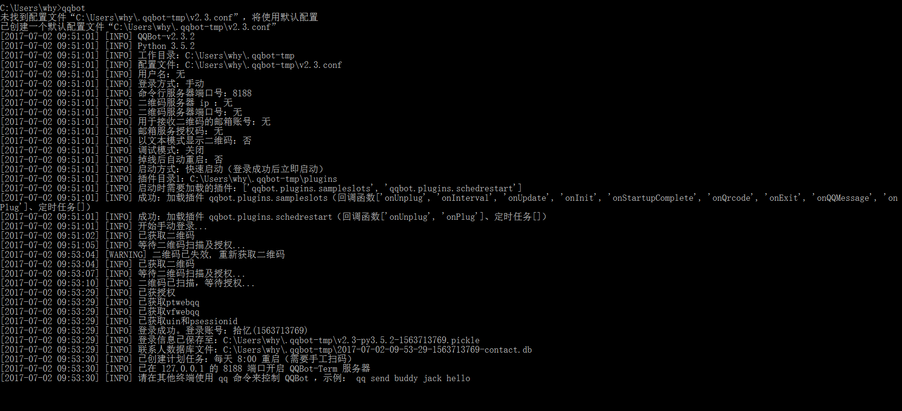
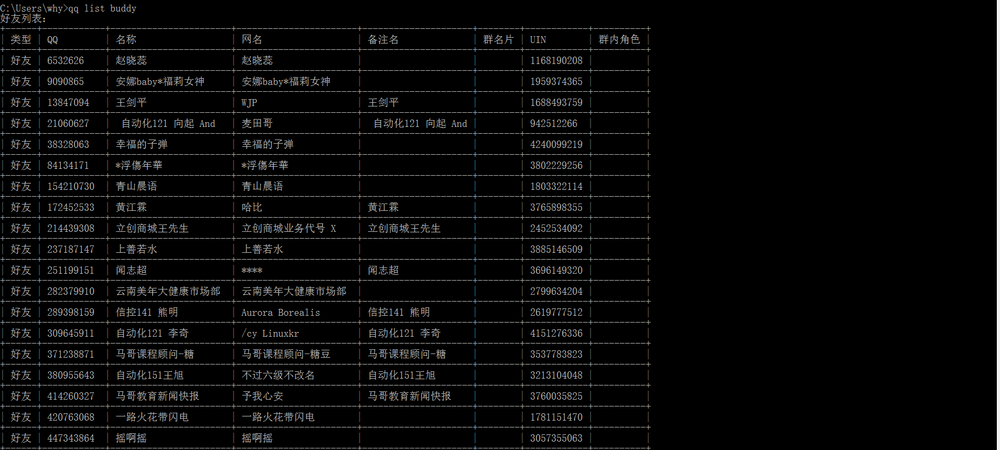
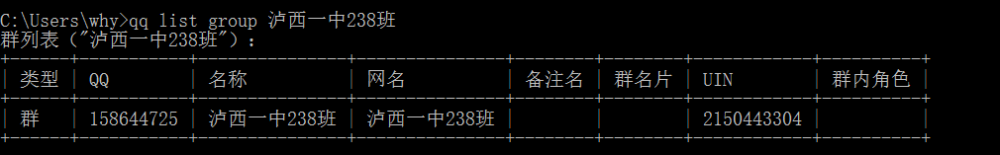

# python实现qq签到记录机器人 #
1. qqbot是一个第三方的python模块，基于smartqq的机器人。
2. qq机器人实现思路:
黑金产业链：以盗号、贩卖账号为主体的黑色产业链。
  - 按键精灵
  - Web qq
3. qqbot安装：`pip install qqbot`
4. 在dos下输入命令：qqbot，系统会弹出一个qq登陆的二维码，打开手机qq扫描登陆即可。

 
5. 这时候就登陆上了网页qq了，再重新打开一个cmd输入以下命令。

 
6. qqbot的操作方式（3中）
- 脚本请求模式：按照爬虫的思路向服务器发起请求。
- 命令行模式：在命令行中进行操作
  list:
  - 查看所有好友（qq list buddy），
  - 查看所有群(qq list group)，

 
  - 查看具体的一个群(qq list group 泸西一中238班)，

 
  - 查看群的所有好友（qq list group-member 泸西一中238班）

 
- 脚本模式：编写好脚本之后，进行操作
- 完成自动发送信息的功能
- 完成自动回复的功能
  - 但是机器人还缺少运行的逻辑，分析签到机器人的逻辑，记录大家信息的地方 sqlite
  - 每人每天签到一次，每次可以得到2个积分点，每5个积分点可以兑换一次公开课的视频。
- 数据库建模：
  - 签到表
    - 名称
    - QQ号 作为大家的唯一标识
    - 签到次数
    - 签到时间
    - 积分累计
  - 资源表
    - 资源名称
    - 兑换点数
    - 有人@why 签到

