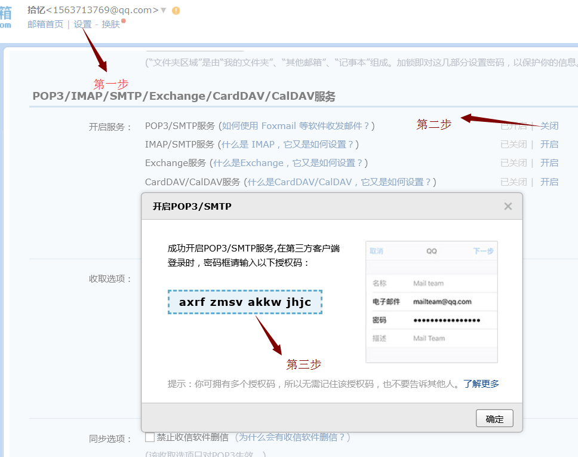

1. email模块，负责编辑发送的内容
2. stmplib模块，负责发送邮件
- 实现：python实现邮件的自动发送
  - SMTP
  - MTA
- SMTP协议的默认TCP端口是25
  - 工作形式：
    - 客户端->服务器
    - 服务器->服务器

- POP
- IMAP
- 邮件格式：
- 收件人
- 发件人
- 主题
- 邮件正文

- 1563713769@qq.com邮箱授权码:axrfzmsvakkwjhjc
- 配置邮件客户端

