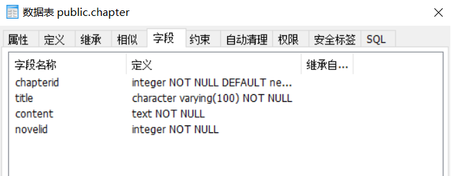
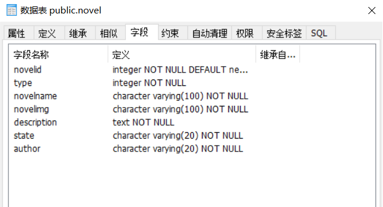

# 本地测试

1. 测试Python操作postgresql数据库

  - 安装Python操作postgresql数据库的模块（psycopg2）。

  - 使用账户postgres，创建测试数据库testdb。

2. 测试django下使用postgreql数据库

  - 使用django命令创建django项目

  ```
  django-admin startproject python_postgresql
  ```

  - 创建项目的app(一个django项目必须包含一个以上的应用)

    - 需要先进入manage.py文件所在目录，执行以下命令

    ```
    python manage.py startapp test_postgresql
    ```

    - 其中一个项目用来处理一种业务，该test_postgresql目录也是一个包。

    - 在 test_postgresql目录下的settings.py文件里面的INSTALLED_APPS中加入该app的名字

3. 在settings.py文件中配置数据库

```python
DATABASES = {

    'default':{
    'ENGINE':'django.db.backends.postgresql_psycopg2',
    'NAME':'testdb',#数据库名字
    'USER':'postgres',#登录用户名
    'PASSWORD':'123456',
    'HOST':'127.0.0.1',#数据库IP地址
    'PORT':'5432',
    }
}
```

4. 用现有的数据库生成ORM

```
python manage.py inspectdb > test_postgresql/models.py
```

  - 生成的代码如下:

```python
class Member(models.Model):
    id = models.IntegerField(primary_key=True)
    name = models.CharField(max_length=32)
    password = models.CharField(max_length=32)
    singal = models.CharField(max_length=128, blank=True, null=True)

    class Meta:
        managed = False
        db_table = 'member'
```

5. 使用如下的命令来更新应用

```
python manage.py migrate
```

6. 测试python爬取小说网的数据（爬取全书网http://www.quanshuwang.com/）

  - 整站爬虫，存储到自己的数据库。

  - 正则表达式：

    - .匹配除了\n \r以外的所有字符

    - *前面的字符出现任意次数

    - ？非贪婪匹配

7. 数据库的设计：

  - 分类 小说名 章 内容

  - 一共两张表：

    - 章节表（Chapter）：
    - 小说表（Novel）

 

```python
chapterid = models.AutoField(primary_key=True)
novelid = models.ForeignKey('Novel', models.DO_NOTHING, db_column='novelid')
title = models.CharField(max_length=100)
content = models.TextField()
```



```python
 type = models.IntegerField()
 novelname = models.CharField(max_length=100)
 novelimg = models.CharField(max_length=100)
 description = models.TextField()
 state = models.CharField(max_length=20)
 author = models.CharField(max_length=20)
```

8. 将爬取到的小说数据插入到数据库中去
9. 创建django项目，并同步到服务器

- 在setting.py文件中修改配置信息


```python
LANGUAGE_CODE = 'zh-Hans'
TIME_ZONE = 'Asia/Shanghai'
```

- 为django自带的后台创建一个用户

  - 创建命令为:`python manage.py createsuperuser`

  - 用户名默认为`root`

  - 密码设置为：`13988097944why`

10. 把postgresql数据库中表添加到后台中去

