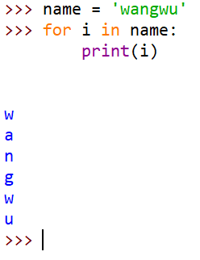
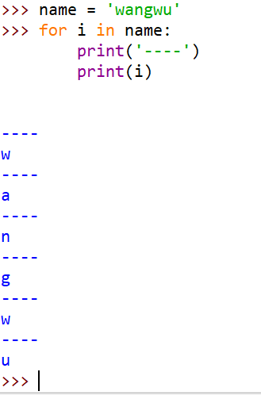
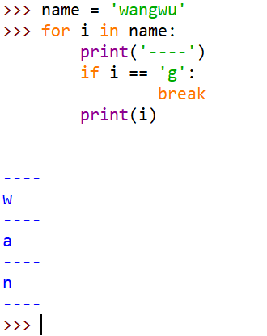
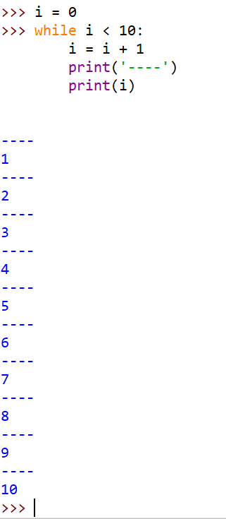
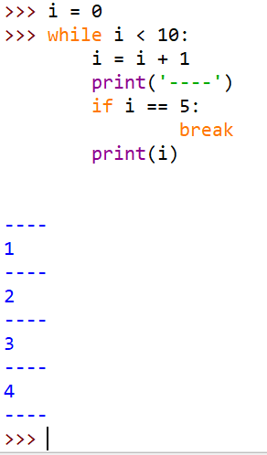
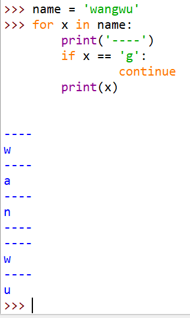
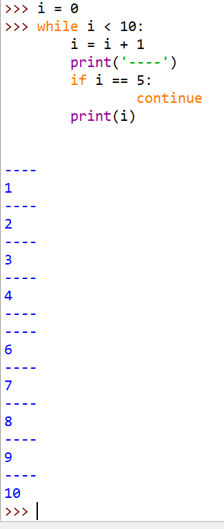

# 认识python(了解)

## 1. Python发展历史

- 起源

Python的作者，Guido von Rossum（龟叔），荷兰人。1982年，Guido从阿姆斯特丹大学获得了数学和计算机硕士学位。然而，尽管他算得上是一位数学家，但他更加享受计算机带来的乐趣。用他的话说，尽管拥有数学和计算机双料资质，他总趋向于做计算机相关的工作，并热衷于做任何和编程相关的活儿。


- Python的意思是蟒蛇，源于作者喜欢的一部电视剧 
- Python是龟叔在1989年圣诞节期间，为了打发无聊的圣诞节而用C编写的一个编程语言
- Python正式诞生于1991年
- Python的解释器如今有多个语言实现，我们常用的是CPython（官方版本的C语言实现），其他还有Jython（可以运行在Java平台）、IronPython（可以运行在.NET和Mono平台）、PyPy（Python实现的，支持JIT即时编译）
- Python目前有两个版本，Python2和Python3，最新版分别为2.7.13和3.6.2，现阶段大部分公司用的是Python2
- Life is shot, you need Python. 人生苦短，我用Python。

### 2. Python优缺点

#### 优点

- 简单—Python是一种代表简单主义思想的语言。阅读一个良好的Python程序就感觉像是在读英语一样，尽管这个英语的要求非常严格！Python的这种伪代码本质是它最大的优点之一。它使你能够专注于解决问题而不是去搞明白语言本身。
- 易学—就如同你即将看到的一样，Python极其容易上手。前面已经提到了，Python有极其简单的语法。
- 免费、开源—Python是FLOSS（自由/开放源码软件）之一。简单地说，你可以自由地发布这个软件的拷贝、阅读它的源代码、对它做改动、把它的一部分用于新的自由软件中。
- 高层语言—当你用Python语言编写程序的时候，你无需考虑诸如如何管理你的程序使用的内存一类的底层细节。
- 可移植性—由于它的开源本质，Python已经被移植在许多平台上（经过改动使它能够工作在不同平台上）。如果你小心地避免使用依赖于系统的特性，那么你的所有Python程序无需修改就可以在下述任何平台上面运行。这些平台包括Linux、Windows、FreeBSD、Macintosh、Solaris、OS/2、Amiga、AROS、AS/400、BeOS、OS/390、z/OS、Palm OS、QNX、VMS、Psion、Acom RISC OS、VxWorks、PlayStation、Sharp Zaurus、Windows CE甚至还有PocketPC、Symbian以及Google基于linux开发的Android平台！
- 解释性—这一点需要一些解释。一个用编译性语言比如C或C++写的程序可以从源文件（即C或C++语言）转换到一个你的计算机使用的语言（二进制代码，即0和1）。这个过程通过编译器和不同的标记、选项完成。当你运行你的程序的时候，连接/转载器软件把你的程序从硬盘复制到内存中并且运行。而Python语言写的程序不需要编译成二进制代码。你可以直接从源代码运行程序。在计算机内部，Python解释器把源代码转换成称为字节码的中间形式，然后再把它翻译成计算机使用的机器语言并运行。事实上，由于你不再需要担心如何编译程序，如何确保连接转载正确的库等等，所有这一切使得使用Python更加简单。由于你只需要把你的Python程序拷贝到另外一台计算机上，它就可以工作了，这也使得你的Python程序更加易于移植。
- 面向对象—Python既支持面向过程的编程也支持面向对象的编程。在“面向过程”的语言中，程序是由过程或仅仅是可重用代码的函数构建起来的。在“面向对象”的语言中，程序是由数据和功能组合而成的对象构建起来的。与其他主要的语言如C++和Java相比，Python以一种非常强大又简单的方式实现面向对象编程。
- 可扩展性—如果你需要你的一段关键代码运行得更快或者希望某些算法不公开，你可以把你的部分程序用C或C++编写，然后在你的Python程序中使用它们。
- 丰富的库—Python标准库确实很庞大。它可以帮助你处理各种工作，包括正则表达式、文档生成、单元测试、线程、数据库、网页浏览器、CGI、FTP、电子邮件、XML、XML-RPC、HTML、WAV文件、密码系统、GUI（图形用户界面）、Tk和其他与系统有关的操作。记住，只要安装了Python，所有这些功能都是可用的。这被称作Python的“功能齐全”理念。除了标准库以外，还有许多其他高质量的库，如wxPython、Twisted和Python图像库等等。
- 规范的代码—Python采用强制缩进的方式使得代码具有极佳的可读性。

#### 缺点

1. 运行速度，有速度要求的话，用C++改写关键部分吧。
2. 国内市场较小（国内以python来做主要开发的，目前只有一些web2.0公司）。但时间推移，目前很多国内软件公司，尤其是游戏公司，也开始规模使用他。
3. 中文资料匮乏（好的python中文资料屈指可数）。托社区的福，有几本优秀的教材已经被翻译了，但入门级教材多，高级内容还是只能看英语版。
4. 构架选择太多（没有像C#这样的官方.net构架，也没有像ruby由于历史较短，构架开发的相对集中。Ruby on Rails 构架开发中小型web程序天下无敌）。不过这也从另一个侧面说明，python比较优秀，吸引的人才多，项目也多。

## 3. Python应用场景

- **Web应用开发**

  Python经常被用于Web开发。比如，通过mod_wsgi模块，Apache可以运行用Python编写的Web程序。Python定义了WSGI标准应用接口来协调Http服务器与基于Python的Web程序之间的通信。一些Web框架，如Django,TurboGears,web2py,Zope等，可以让程序员轻松地开发和管理复杂的Web程序。

- **大数据**

  百万行级不算大数据量，以目前的互联网应用来看，大数据量的起点是10亿条以上。处理的具体含义，如果是数据载入和分发，用python是很高效的；如果是求一些常用的统计量和求一些基本算法的结果，python也有现成的高效的库，C实现的和并行化的如果是纯粹自己写的算法，没有任何其他可借鉴的，什么库也用不上，用纯python写大数据处理模块是自讨苦吃。python的优势不在于运行效率，而在于开发效率和高可维护性。针对特定的问题挑选合适的工具，本身也是一项技术能力。

- **操作系统管理、服务器运维的自动化脚本**

  在很多操作系统里，Python是标准的系统组件。 大多数Linux发行版以及NetBSD、OpenBSD和Mac OS X都集成了Python，可以在终端下直接运行Python。有一些Linux发行版的安装器使用Python语言编写，比如Ubuntu的Ubiquity安装器,Red Hat Linux和Fedora的Anaconda安装器。Gentoo Linux使用Python来编写它的Portage包管理系统。Python标准库包含了多个调用操作系统功能的库。通过pywin32这个第三方软件 包，Python能够访问Windows的COM服务及其它Windows API。使用IronPython，Python程序能够直接调用.Net Framework。一般说来，Python编写的系统管理脚本在可读性、性能、代码重用度、扩展性几方面都优于普通的shell脚本。

- **科学计算**

  NumPy,SciPy,Matplotlib可以让Python程序员编写科学计算程序。

- **桌面软件**

  PyQt、PySide、wxPython、PyGTK是Python快速开发桌面应用程序的利器。

- **服务器软件（网络软件）**

  Python对于各种网络协议的支持很完善，因此经常被用于编写服务器软件、网络爬虫。第三方库Twisted支持异步网络编程和多数标准的网络协议(包含客户端和服务器)，并且提供了多种工具，被广泛用于编写高性能的服务器软件。

- **游戏**

  很多游戏使用C++编写图形显示等高性能模块，而使用Python或者Lua编写游戏的逻辑、服务器。相较于Python，Lua的功能更简单、体积更小；而Python则支持更多的特性和数据类型。

- **构思实现，产品早期原型和迭代**

  YouTube、Google、Yahoo!、NASA都在内部大量地使用Python。

- [2017编程语言排行榜](http://www.eepw.com.cn/article/201707/361978.htm)

# 编写第一个python程序

<1>在编写python程序之前需要安装其开发环境：[python官网](https://www.python.org/)

<2>打开python的交互环境，输入：

```
print('hello world')
```

<3>运行结果：

```
hello world
```

<3>要求：编写一个程序，输出`http://www.controllab.net`

# 注释

## <1> 单行注释

以#开头，#右边的所有东西当做注释，而不是真正要执行的程序，起辅助说明作用

```
    # 我是注释，可以在里写一些功能说明之类的信息
    print('hello world')
```

## <2> 多行注释

```
    '''我是多行注释，可以写很多很多行的功能说明
        从今天开始学习python

        加油，加油。。。
    '''
```

# 变量以及类型

## <1>变量的定义

在程序中，有时我们需要对2个数据进行求和，那么该怎样做呢？

大家类比一下现实生活中，比如去超市买东西，往往咱们需要一个菜篮子，用来进行存储物品，等到所有的物品都购买完成后，在收银台进行结账即可。

如果在程序中，需要把2个数据，或者多个数据进行求和的话，那么就需要把这些数据先存储起来，然后把它们累加起来即可。

在Python中，存储一个数据，需要一个叫做`变量`的东西，如下示例:

```
    num1 = 100 #num1就是一个变量，就好一个小菜篮子
    num2 = 87  #num2也是一个变量
    result = num1 + num2 #把num1和num2这两个"菜篮子"中的数据进行累加，然后放到 result变量中
```

- 说明:
  - 所谓变量，可以理解为`菜篮子`，如果需要存储多个数据，最简单的方式是有多个变量，当然了也可以使用一个
  - **程序就是用来处理数据的，而变量就是用来存储数据的**

#### 想一想：我们应该让变量占用多大的空间，保存什么样的数据？

## <2>变量的类型

为了更充分的利用内存空间以及更有效率的管理内存，变量是有不同的类型的，如下所示:


怎样知道一个变量的类型呢？

- 在python中，只要定义了一个变量，而且它有数据，那么它的类型就已经确定了，不需要咱们开发者主动的去说明它的类型，系统会自动辨别。
- 可以使用type(变量的名字)，来查看变量的类型。

# 标示符和关键字

## <1>标示符

- 什么是标示符

  > 开发人员在程序中自定义的一些符号和名称
  >
  > 标示符是自己定义的,如变量名 、函数名等

## <2>标示符的规则

- 标示符由字母、下划线和数字组成，且数字不能开头


- python中的标识符是区分大小写的


## <3>命名规则

- 见名知意

  > 起一个有意义的名字，尽量做到看一眼就知道是什么意思(提高代码可 读性) 比如: 名字就定义为 name , 定义学生 用 student

- 驼峰命名法

  > 小驼峰式命名法（lower camel case）： 第一个单词以小写字母开始；第二个单词的首字母大写，例如：myName、aDog
  >
  > 大驼峰式命名法（upper camel case）： 每一个单字的首字母都采用大写字母，例如：FirstName、LastName
  >
  > 不过在程序员中还有一种命名法比较流行，就是用下划线“_”来连接所有的单词，比如send_buf

## <4>关键字

- 什么是关键字

  > python一些具有特殊功能的标示符，这就是所谓的关键字
  >
  > 关键字，是python已经使用的了，所以不允许开发者自己定义和关键字相同的名字的标示符

- 查看关键字，可以通过以下命令进行查看当前系统中python的关键字

```
  import keyword
  keyword.kwlist
```

-   运行结果：


```
  ['False', 'None', 'True', 'and', 'as', 'assert', 'break', 'class', 'continue', 'def', 'del', 'elif', 'else', 'except', 'finally', 'for', 'from', 'global', 'if', 'import', 'in', 'is', 'lambda', 'nonlocal', 'not', 'or', 'pass', 'raise', 'return', 'try', 'while', 'with', 'yield']
```

# 输出

## 1. 普通的输出

- python中变量的输出

```
    # 打印提示
    print('hello world')
    print('欢迎来到python的世界')
```

## 2. 格式化输出

### <1>格式化操作的目的

比如有以下代码:

```
    pirnt("我今年10岁")
    pirnt("我今年11岁")
    pirnt("我今年12岁")
    ...

```

- 想一想:

  > 在输出年龄的时候，用了多次"我今年xx岁"，能否简化一下程序呢？？？

- 答:

  > 字符串格式化

### <2>什么是格式化

看如下代码:

```
    age = 10
    print("我今年%d岁"%age)

    age += 1
    print("我今年%d岁"%age)

    age += 1
    print("我今年%d岁"%age)

    ...
```

在程序中，看到了`%`这样的操作符，这就是Python中格式化输出。

```
    age = 18
    name = "xiaohua"
    print("我的姓名是%s,年龄是%d"%(name,age))

```

### <3>常用的格式符号

下面是完整的，它可以与％符号使用列表:

| 格式符号 | 转换                |
| ---- | ----------------- |
| %c   | 字符                |
| %s   | 通过str() 字符串转换来格式化 |
| %i   | 有符号十进制整数          |
| %d   | 有符号十进制整数          |
| %u   | 无符号十进制整数          |
| %o   | 八进制整数             |
| %x   | 十六进制整数（小写字母）      |
| %X   | 十六进制整数（大写字母）      |
| %e   | 索引符号（小写'e'）       |
| %E   | 索引符号（大写“E”）       |
| %f   | 浮点实数              |
| %g   | ％f和％e 的简写         |
| %G   | ％f和％E的简写          |

## 3. 换行输出

在输出的时候，如果有`\n`那么，此时`\n`后的内容会在另外一行显示

```
    print("1234567890-------") # 会在一行显示

    print("1234567890\n-------") # 一行显示1234567890，另外一行显示-------

```

## 4. 练一练

- 编写代码完成以下名片的显示

```
    ==================================
    姓名: wangWU    
    QQ:xxxxxxx
    手机号:131xxxxxx
    公司地址:昆明市xxxx
    ==================================
```

# 输入

###  input()

在Python中，获取键盘输入的数据的方法是采用 input 函数（至于什么是函数，咱们以后的章节中讲解），那么这个 input 怎么用呢?

看如下示例:

```
    password = input("请输入密码:")
    print('您刚刚输入的密码是:', password)
```

运行结果:


**注意**:

- input()的小括号中放入的是提示信息，用来在获取数据之前给用户的一个简单提示
- input()在从键盘获取了数据以后，会存放到等号右边的变量中
- input()会把用户输入的任何值都作为字符串来对待

# 运算符

python支持以下几种运算符

- 算术运算符

下面以a=10 ,b=20为例进行计算

| 运算符  | 描述   | 实例                                       |
| ---- | ---- | ---------------------------------------- |
| +    | 加    | 两个对象相加 a + b 输出结果 30                     |
| -    | 减    | 得到负数或是一个数减去另一个数 a - b 输出结果 -10           |
| *    | 乘    | 两个数相乘或是返回一个被重复若干次的字符串 a * b 输出结果 200     |
| /    | 除    | x除以y b / a 输出结果 2                        |
| //   | 取整除  | 返回商的整数部分 9//2 输出结果 4 , 9.0//2.0 输出结果 4.0 |
| %    | 取余   | 返回除法的余数 b % a 输出结果 0                     |
| **   | 幂    | 返回x的y次幂 a**b 为10的20次方， 输出结果 100000000000000000000 |

```
>>> 9/2.0
4.5
>>> 9//2.0
4.0
```

- 赋值运算符

| 运算符  | 描述    | 实例                                 |
| ---- | ----- | ---------------------------------- |
| =    | 赋值运算符 | 把=号右边的结果给左边的变量 num=1+2*3 结果num的值为7 |

```
>>> a, b = 1, 2
>>> a
1
>>> b
2

```

- 复合赋值运算符

| 运算符  | 描述       | 实例                     |
| ---- | -------- | ---------------------- |
| +=   | 加法赋值运算符  | c += a 等效于 c = c + a   |
| -=   | 减法赋值运算符  | c -= a 等效于 c = c - a   |
| *=   | 乘法赋值运算符  | c *= a 等效于 c = c * a   |
| /=   | 除法赋值运算符  | c /= a 等效于 c = c / a   |
| %=   | 取模赋值运算符  | c %= a 等效于 c = c % a   |
| **=  | 幂赋值运算符   | c **= a 等效于 c = c ** a |
| //=  | 取整除赋值运算符 | c //= a 等效于 c = c // a |

# 常用的数据类型转换

| 函数                     | 说明                            |
| ---------------------- | ----------------------------- |
| int(x [,base ])        | 将x转换为一个整数                     |
| long(x [,base ])       | 将x转换为一个长整数                    |
| float(x )              | 将x转换到一个浮点数                    |
| complex(real [,imag ]) | 创建一个复数                        |
| str(x )                | 将对象 x 转换为字符串                  |
| repr(x )               | 将对象 x 转换为表达式字符串               |
| eval(str )             | 用来计算在字符串中的有效Python表达式,并返回一个对象 |
| tuple(s )              | 将序列 s 转换为一个元组                 |
| list(s )               | 将序列 s 转换为一个列表                 |
| chr(x )                | 将一个整数转换为一个字符                  |
| unichr(x )             | 将一个整数转换为Unicode字符             |
| ord(x )                | 将一个字符转换为它的整数值                 |
| hex(x )                | 将一个整数转换为一个十六进制字符串             |
| oct(x )                | 将一个整数转换为一个八进制字符串              |

## 举例

```
    a = '100' # 此时a的类型是一个字符串，里面存放了100这3个字符
    b = int(a) # 此时b的类型是整型，里面存放的是数字100

    print("a=%d"%b)
```

# if判断语句

## <1>if判断语句介绍

- if语句是用来进行判断的，其使用格式如下：

```
    if 要判断的条件:
        条件成立时，要做的事情
```

- demo1:

```
    age = 30
    print "------if判断开始------"
    if age>=18:
        print "我已经成年了"
    print "------if判断结束------"
```

- 运行结果:

```
    ------if判断开始------
    我已经成年了
    ------if判断结束------

```

- demo2:

```
    age = 16
    print "------if判断开始------"
    if age>=18:
        print "我已经成年了"
    print "------if判断结束------"
```

- 运行结果:

```
    ------if判断开始------
    ------if判断结束------

```

小总结：

- 以上2个demo仅仅是age变量的值不一样，结果却不同；能够看得出if判断语句的作用：就是当满足一定条件时才会执行那块代码，否则就不执行那块代码

注意：

- 代码的缩进为一个tab键，或者4个空格

## <2>练一练

要求：从键盘获取自己的年龄，判断是否大于或者等于18岁，如果满足就输出“哥，已成年，网吧可以去了”

> 1. 使用input从键盘中获取数据，并且存入到一个变量中
> 2. 使用if语句，来判断 age>=18是否成立

## <3>想一想

- 判断age大于或者等于18岁，使用的是 >=，还有哪些呢？

# 比较、关系运算符

## <1> 比较(即关系)运算符

python中的比较运算符如下表

| 运算符  | 描述                               | 示例                                    |
| ---- | -------------------------------- | ------------------------------------- |
| ==   | 检查两个操作数的值是否相等，如果是则条件变为真。         | 如a=3,b=3则（a == b) 为 true.             |
| !=   | 检查两个操作数的值是否相等，如果值不相等，则条件变为真。     | 如a=1,b=3则(a != b) 为 true.             |
| <>   | 检查两个操作数的值是否相等，如果值不相等，则条件变为真。     | 如a=1,b=3则(a <> b) 为 true。这个类似于 != 运算符 |
| >    | 检查左操作数的值是否大于右操作数的值，如果是，则条件成立。    | 如a=7,b=3则(a > b) 为 true.              |
| <    | 检查左操作数的值是否小于右操作数的值，如果是，则条件成立。    | 如a=7,b=3则(a < b) 为 false.             |
| >=   | 检查左操作数的值是否大于或等于右操作数的值，如果是，则条件成立。 | 如a=3,b=3则(a >= b) 为 true.             |
| <=   | 检查左操作数的值是否小于或等于右操作数的值，如果是，则条件成立。 | 如a=3,b=3则(a <= b) 为 true.             |

## <2> 逻辑运算符

| 运算符  | 逻辑表达式   | 描述                                       | 实例                    |
| ---- | ------- | ---------------------------------------- | --------------------- |
| and  | x and y | 布尔"与" - 如果 x 为 False，x and y 返回 False，否则它返回 y 的计算值。 | (a and b) 返回 20。      |
| or   | x or y  | 布尔"或" - 如果 x 是 True，它返回 True，否则它返回 y 的计算值。 | (a or b) 返回 10。       |
| not  | not x   | 布尔"非" - 如果 x 为 True，返回 False 。如果 x 为 False，它返回 True。 | not(a and b) 返回 False |

# 作业

## 必做题：

### 1. 说出变量名字，可以由哪些字符组成

### 2. 写出变量命名时的规则

### 3. 说出什么是驼峰法（大驼峰、小驼峰）

### 4. 编写程序，完成以下要求：

- 提示用户进行输入数据
- 获取用户的数据数据（需要获取2个）
- 对获取的两个数字进行求和运行，并输出相应的结果

### 5. 编写程序，完成以下要求：

- 提示用户进行输入数据
- 获取用户的数据数据（需要获取2个）
- 对获取的两个数字进行减法运行，并输出相应的结果

### 6. 编写程序，完成以下信息的显示:

```
    ==================================
    =        欢迎进入到身份认证系统V1.0
    = 1. 登录
    = 2. 退出
    = 3. 认证
    = 4. 修改密码
    ==================================
```

### 7. 编写程序，从键盘获取一个人的信息，然后按照下面格式显示

```
    ==================================
    姓名: wangwu    
    QQ:xxxxxxx
    手机号:131xxxxxx
    公司地址:昆明市xxxx
    ==================================
```

### 8. 编写程序，从键盘获取用户名和密码，然后判断，如果正确就输出以下信息

```
    亲爱的xxx，欢迎登陆 爱学习管理系统
```

# if-else

> 想一想：在使用if的时候，它只能做到满足条件时要做的事情。那万一需要在不满足条件的时候，做某些事，该怎么办呢？
>
> 答：else

## <1>if-else的使用格式

```
    if 条件:
        满足条件时要做的事情1
        满足条件时要做的事情2
        满足条件时要做的事情3
        ...(省略)...
    else:
        不满足条件时要做的事情1
        不满足条件时要做的事情2
        不满足条件时要做的事情3
        ...(省略)...
```

# 应用:猜拳游戏

## <1>参考代码:

```
    import random
    player = input('请输入：剪刀(0)  石头(1)  布(2):')
    player = int(player)
    computer = random.randint(0,2)
    # 用来进行测试
    #print('player=%d,computer=%d',(player,computer))
    if ((player == 0) and (computer == 2)) or ((player ==1) and (computer == 0)) or ((player == 2) and (computer == 1)):
        print('获胜，哈哈，你太厉害了')
    elif player == computer:
        print('平局，要不再来一局')
    else:
        print('输了，不要走，洗洗手接着来，决战到天亮')
```


# while循环

## <1>while循环的格式

```
    while 条件:
        条件满足时，做的事情1
        条件满足时，做的事情2
        条件满足时，做的事情3
        ...(省略)...

```

demo

```
    i = 0
    while i<5:
        print("当前是第%d次执行循环"%(i+1))
        print("i=%d"%i)
        i+=1

```

结果:

```
    当前是第1次执行循环
    i=0
    当前是第2次执行循环
    i=1
    当前是第3次执行循环
    i=2
    当前是第4次执行循环
    i=3
    当前是第5次执行循环
    i=4
```

# while循环应用

## 1. 计算1~100的累积和（包含1和100）

参考代码如下:

```
i = 1
sum = 0
while i<=100:
    sum = sum + i
    i += 1

print("1~100的累积和为:%d"%sum)
```

## 2. 计算1~100之间偶数的累积和（包含1和100）

参考代码如下:

```
i = 1
sum = 0
while i<=100:
    if i%2 == 0:
        sum = sum + i
    i+=1

print("1~100的累积和为:%d"%sum)
```

# for循环

像while循环一样，for可以完成循环的功能。

在Python中 for循环可以遍历任何序列的项目，如一个列表或者一个字符串等。

## for循环的格式

```
    for 临时变量 in 列表或者字符串等:
        循环满足条件时执行的代码
    else:
        循环不满足条件时执行的代码

```

## demo1

```
    name = 'wangwu'

    for i in name:
        print(i)
```

运行结果如下:



# break和continue

## 1. break

### <1> for循环

- 普通的循环示例如下：

  ```
    name = 'wangwu'

    for i in name:
        print('----')
        print(i)
  ```

  运行结果:

  

- 带有break的循环示例如下:

  ```
    name = 'wangwu'

    for i in name:
        print('----')
        if i == 'g': 
            break
        print(i)
  ```

  运行结果:

  

### <2> while循环

- 普通的循环示例如下：

  ```
    i = 0
    while i<10:
        i = i+1
        print('----')
        print(i)
  ```

  运行结果:

  

- 带有break的循环示例如下:

  ```
    i = 0

    while i<10:
        i = i+1
        print('----')
        if i==5:
            break
        print(i)

  ```

  运行结果:

  

### **小总结:**

- break的作用：用来结束整个循环

## 2. continue

### <1> for循环

- 带有continue的循环示例如下:

  ```
    name = 'wangwu'

    for x in name:
        print('----')
        if x == 'g': 
            continue
        print(x)
  ```

  运行结果:

  

### <2> while循环

- 带有continue的循环示例如下:

  ```
    i = 0
    while i<10:
        i = i+1
        print('----')
        if i==5:
            continue
        print(i)
  ```

  运行结果:

  


- 小总结:
  - continue的作用：用来结束本次循环，紧接着执行下一次的循环

## 3. 注意点

- break/continue只能用在循环中，除此以外不能单独使用
- break/continue在嵌套循环中，只对最近的一层循环起作用

# 练习

## 必做题：

### 1. 使用if，编写程序，实现以下功能：

- 从键盘获取用户名、密码
- 如果用户名和密码都正确（预先设定一个用户名和密码），那么就显示“欢迎进入xxx的世界”，否则提示密码或者用户名错误

### 2. 使用while，完成以下图形的输出

```
*
* *
* * *
* * * *
* * * * *
* * * *
* * *
* *
*
```