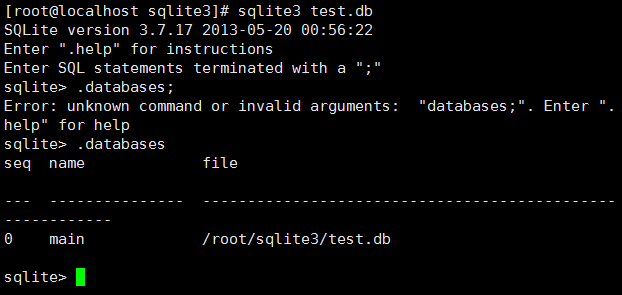
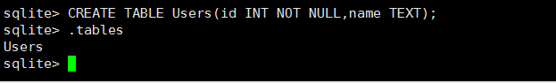
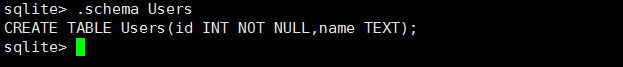
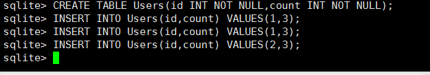
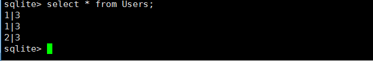
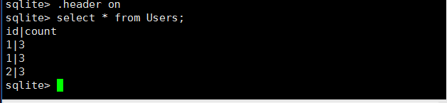
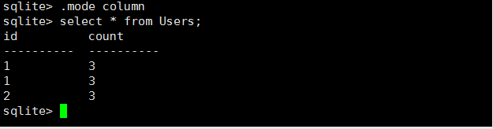

1. CentOS 安装Sqlite3:
  - http://blog.csdn.net/superbfly/article/details/35779697

2. Windows 安装Sqlite3:
  - http://blog.csdn.net/kasama1953/article/details/52584945

3. 一个文件就对应一个数据库。
  - 使用方法：在控制台下输入命令sqlite3,回车即可。
  - 退出：.quit或者.exit
  - 创建数据库（并打开数据库）：sqlite3 test.db
 

  - 创建表：
```sql
CREATE TABLE Users(id INT NOT NULL,name TEXT);
CREATE TABLE Users(id INT NOT NULL,count INT NOT NULL);
```


 
  - 查看表的信息：`.schema Users`



  - 删除表：`DROP TABLE Users;`
  - 插入数据：
```sql
INSERT INTO Users(id,name) VALUES(1,’lisi’);
INSERT INTO Users(id,count) VALUES(1,3);
```


  - 查询数据：`select * from Users;`


 
  - 打开头部信息：


 
  - 打开显示模式;


4. python操作sqlite3
  - http://www.cnblogs.com/hongten/p/hongten_python_sqlite3.html
